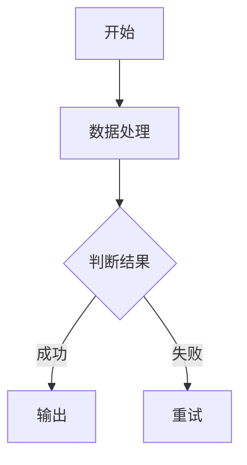
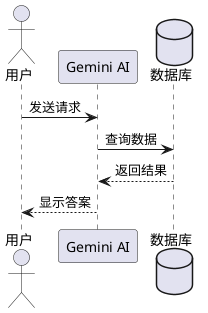

# Gemini Mermaid Renderer

一个 Chrome 浏览器扩展，用于在 Google Gemini 网页界面中自动渲染 Mermaid 和 PlantUML 图表。

## 功能特性

- 📊 **自动识别图表代码** - 在 Gemini 对话中自动识别 Mermaid 和 PlantUML 代码块
- 🎨 **实时渲染** - 支持图表的即时预览和渲染
- 🔄 **流式输出支持** - 兼容 Gemini 的流式输出，实时更新图表
- 🌐 **双引擎支持** - 同时支持 Mermaid.js 和 PlantUML 图表
- 🖼️ **视图切换** - 在源码视图和图表预览之间自由切换
- ❌ **错误处理** - 友好的错误提示和错误定位
- ⚡ **高性能** - 基于浏览器本地渲染，响应迅速

## 技术栈

- **前端框架**: React 19 + TypeScript
- **构建工具**: Vite 7.2
- **样式**: Tailwind CSS 4.1
- **图表引擎**:
  - Mermaid.js 11.12 - 用于 Mermaid 图表渲染
  - PlantUML Encoder - 用于 PlantUML 图表编码
- **Chrome 扩展**: @crxjs/vite-plugin 2.3
- **开发工具**: ESLint, TypeScript

## 安装方法

### 开发模式安装

1. 克隆项目仓库：
```bash
git clone https://github.com/yourusername/gemini-mermaid-uml-chrome-extension.git
cd gemini-mermaid-uml-chrome-extension
```

2. 安装依赖：
```bash
npm install
```

3. 构建项目：
```bash
npm run build
```

4. 在 Chrome 浏览器中加载扩展：
   - 打开 Chrome 扩展管理页面：`chrome://extensions/`
   - 开启"开发者模式"
   - 点击"加载已解压的扩展程序"
   - 选择项目的 `dist` 目录

### 开发模式

启动开发服务器（支持热更新）：
```bash
npm run dev
```

在 Chrome 扩展管理页面重新加载扩展即可看到更新。

## 使用方法

1. 打开 [Google Gemini](https://gemini.google.com)
2. 让 AI 生成 Mermaid 或 PlantUML 代码，例如：

### Mermaid 示例



### PlantUML 示例



3. 代码块上方会自动出现渲染按钮，点击即可切换图表预览和源码视图

## 支持的图表类型

### Mermaid
- 流程图 (Flowchart)
- 序列图 (Sequence Diagram)
- 类图 (Class Diagram)
- 状态图 (State Diagram)
- 实体关系图 (ER Diagram)
- 甘特图 (Gantt Chart)
- 饼图 (Pie Chart)
- Git 图 (Git Graph)
- 旅程图 (Journey Diagram)
- 思维导图 (Mindmap)
- 时间线 (Timeline)
- 四象限图 (Quadrant Chart)
- XY 图表 (XY Chart)
- C4 架构图 (C4 Diagram)
- 看板图 (Kanban)
- 块图 (Block Diagram)

### PlantUML
- 所有标准的 PlantUML 图表类型
- 使用在线渲染服务 (plantuml.com)

## 项目结构

```
gemini-mermaid-uml-chrome-extension/
├── src/
│   ├── content/           # 内容脚本（注入到 Gemini 页面）
│   │   ├── index.tsx      # 主入口，DOM 监听和处理
│   │   ├── selectors.ts   # DOM 选择器和图表类型识别
│   │   └── styles.css     # 样式定义
│   ├── components/        # React 组件
│   │   └── DiagramToggle.tsx  # 视图切换按钮组件
│   ├── utils/             # 工具函数
│   │   ├── mermaid.ts     # Mermaid 渲染逻辑
│   │   └── plantuml.ts    # PlantUML 渲染逻辑
│   ├── background/        # 后台脚本
│   │   └── index.ts
│   ├── App.tsx            # 扩展弹窗页面
│   └── main.tsx
├── public/                # 静态资源
├── manifest.json          # Chrome 扩展配置
├── vite.config.ts         # Vite 配置
├── tailwind.config.js     # Tailwind CSS 配置
└── package.json
```

## 工作原理

1. **DOM 监听**：内容脚本使用 MutationObserver 监听 Gemini 页面的 DOM 变化
2. **代码块识别**：通过选择器识别 `<code-block>` 元素，并通过类名和关键词判断图表类型
3. **按钮注入**：在识别到的代码块头部注入渲染切换按钮
4. **图表渲染**：
   - Mermaid：使用 Mermaid.js 在浏览器本地渲染
   - PlantUML：将代码编码后请求 PlantUML 在线服务获取 SVG
5. **视图管理**：通过切换 `display` 属性在源码和图表预览之间切换

## 注意事项

- 扩展仅在 `gemini.google.com` 域名下生效
- PlantUML 图表依赖在线渲染服务，需要网络连接
- 某些复杂的 Mermaid 图表可能需要调整代码才能正确渲染
- 渲染错误时会显示友好的错误提示和错误行号

## 开发命令

```bash
# 安装依赖
npm install

# 开发模式（支持热更新）
npm run dev

# 构建生产版本
npm run build

# 代码检查
npm run lint

# 预览构建结果
npm run preview
```

## 许可证

MIT License

## 贡献

欢迎提交 Issue 和 Pull Request！

## 致谢

- [Mermaid.js](https://mermaid.js.org/) - 强大的图表渲染库
- [PlantUML](https://plantuml.com/) - 优秀的 UML 绘图工具
- [Vite](https://vitejs.dev/) - 快速的前端构建工具
- [React](https://react.dev/) - 用于构建用户界面


You can also install [eslint-plugin-react-x](https://github.com/Rel1cx/eslint-react/tree/main/packages/plugins/eslint-plugin-react-x) and [eslint-plugin-react-dom](https://github.com/Rel1cx/eslint-react/tree/main/packages/plugins/eslint-plugin-react-dom) for React-specific lint rules:

```js
// eslint.config.js
import reactX from 'eslint-plugin-react-x'
import reactDom from 'eslint-plugin-react-dom'

export default defineConfig([
  globalIgnores(['dist']),
  {
    files: ['**/*.{ts,tsx}'],
    extends: [
      // Other configs...
      // Enable lint rules for React
      reactX.configs['recommended-typescript'],
      // Enable lint rules for React DOM
      reactDom.configs.recommended,
    ],
    languageOptions: {
      parserOptions: {
        project: ['./tsconfig.node.json', './tsconfig.app.json'],
        tsconfigRootDir: import.meta.dirname,
      },
      // other options...
    },
  },
])
```
